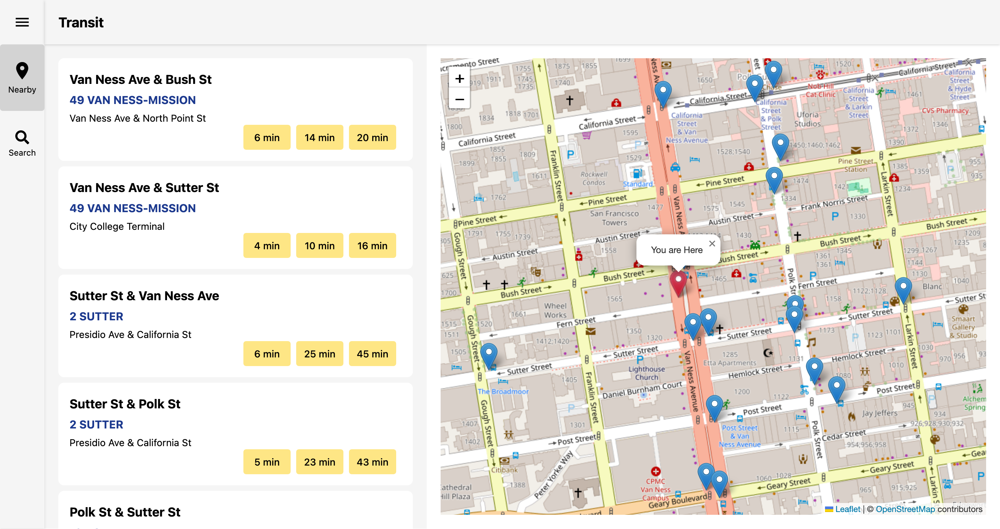
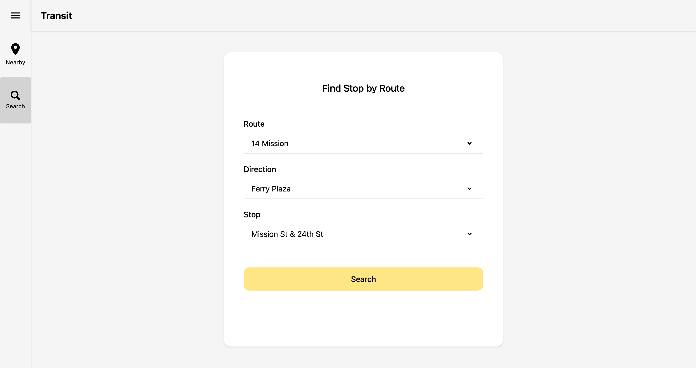

# Transit

Transit is a full stack web application that provides real time transit information for San Francisco Muni. This project utilizes public transit data from GTFS feeds and the 511 API and is built with React, Node.js, and PostgreSQL.

The app uses Render to host both the PostgreSQL database and backend and GitHub pages to host the frontend.

Access a live demo [here](https://pan-cynthia.github.io/transit/).

## Preview





## Note

The backend is hosted on a free Render service that goes to sleep when inactive.

If no data is showing up on the frontend (GitHub pages), please visit the backend once to wake it up: [Backend API](https://transit-43ic.onrender.com/)

After ~30 seconds, refresh the frontend and it should display correctly.

## Features

- Browse nearby transit stops using geolocation
- View routes, directions, and stops for each transit line
- Real-time data integration with 511 API
- Database driven route and stop data for fast querying
- Interactive map with stop locations and routes

## Tech Stack

### Frontend
  - React - Component based UI
  - Axios - API communication
  - React Router - Client side routing
  - Tailwind CSS - Styling and responsive design

### Backend
  - Node.js & Express - RESTful API and server logic

### Database
  - PostgreSQL - Database

### Deployment
  - Frontend - GitHub Pages
  - Backend + Database - Render

## Getting Started

To install and run the app locally, follow these steps in your terminal:

### 1. Clone the repository

```bash
git clone https://github.com/pan-cynthia/transit.git
cd transit
```

### 2. Install dependencies

```bash
cd backend
npm install

cd ../frontend
npm install
```

### 3. Obtain an API key

1. Visit the [511 API portal](https://511.org/open-data/token)
2. Sign up for a token
3. Add your 511 API key to `backend/.env`

    ```bash
    TRANSIT_API_KEY=your_511_api_key
    ```

### 4. Configure environment variables

Copy the example env file (.env.example) for both the backend and frontend and fill in your own values. 

Do not commit your .env files to GitHub as they contain private information such as API keys.

```bash
# backend
cp backend/.env.example backend/.env

# frontend
cp frontend/.env.example frontend/.env
```

### 5. Set up database

#### Option 1 - Use the public database hosted on Render

To get started quickly without setting up your own PostgreSQL instance, use the preconfigured `DATABASE_URL` in `backend/.env.example` to connect to the hosted database on Render.

#### Option 2 - Use your own PostgreSQL database

1. Install PostgreSQL locally
2. Create a new database
3. Run the SQL schema file `schema.sql` to create the tables and views
    ```bash
    psql -U your_user_name -d your_database_name -f schema.sql
    ```
4. Update the `POSTGRES_*` variables in `backend/.env` with your local database credentials
5. Set `NODE_ENV`=development in `backend/.env`
6. Download and import GTFS data from: http://api.511.org/transit/datafeeds?api_key=[your_api_key]&operator_id=SF
 and replace `[your_api_key]` with your API key
7. The GTFS data files contain static transit information used to populate the database tables. Unzip the contents (`routes.txt`, `stops.txt`, `trips.txt`, `stop_times.txt`, `shapes.txt`) and import them into your database tables.

    ```bash
    \copy routes FROM 'path/to/routes.txt' WITH (FORMAT csv, HEADER true);
    \copy stops FROM 'path/to/stops.txt' WITH (FORMAT csv, HEADER true);
    \copy trips FROM 'path/to/trips.txt' WITH (FORMAT csv, HEADER true);
    \copy stop_times FROM 'path/to/stop_times.txt' WITH (FORMAT csv, HEADER true);
    \copy shapes FROM 'path/to/shapes.txt' WITH (FORMAT csv, HEADER true);
    ```

8. Refresh the materialized view.

    ```
    REFRESH MATERIALIZED VIEW stops_list;
    ```

### 6. Start the development server

```bash
cd backend
npm run dev
```

Backend should be up and running on http://localhost:3000

### 7. Run the frontend
In a new terminal:

```
cd frontend
npm run dev
```
Frontend should be running at http://localhost:5173

---
